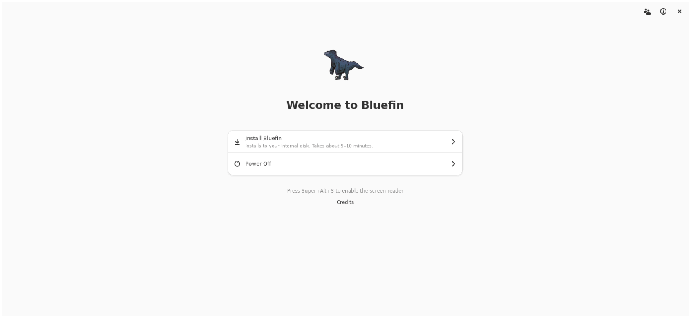
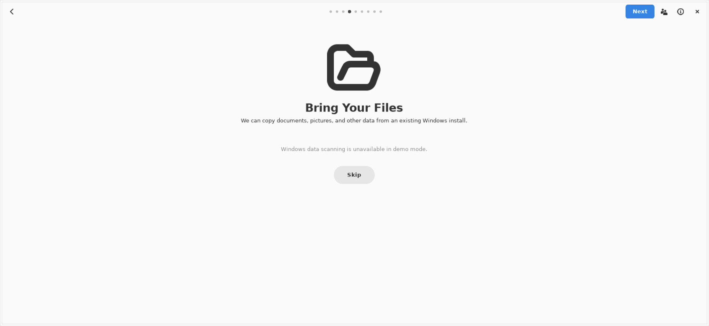
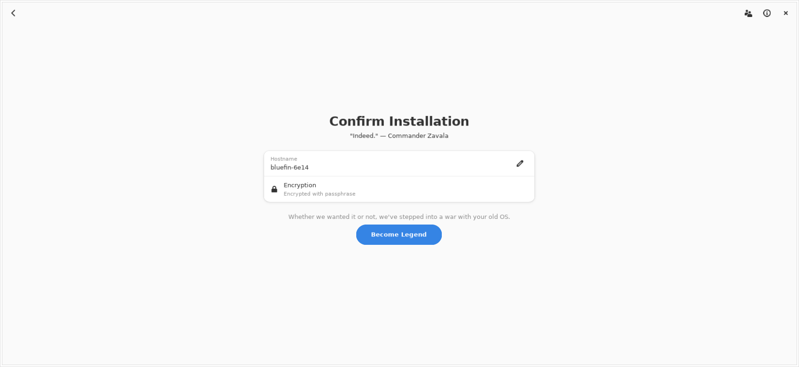
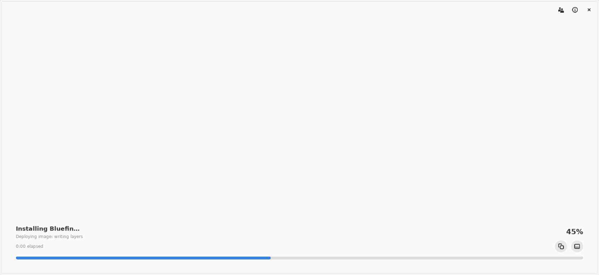
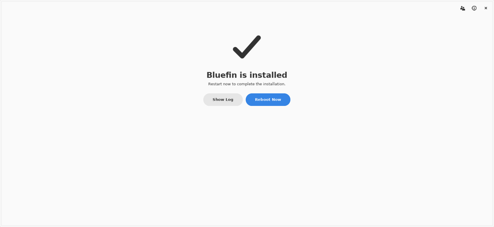

# GNOME installer walkthrough

Every image below is rendered in CI from the real GTK4 / libadwaita wizard by
`tests/gui/capture-screens.py`: the same `BootcWindow` the Flatpak presents,
driven page by page under Xvfb against fixtures (two canned disks, no
network, the repository's own `recipe.json`). Nothing is mocked in the UI
and nothing touches a disk. See `.github/workflows/screenshots-gnome.yml`.

The cross-frontend view, with the KDE, COSMIC, Niri and XFCE installers side
by side and the parity matrix on top, is [`walkthrough/`](walkthrough/README.md).

<p align="center">
  
</p>

## The pages

| | |
|---|---|
|  | **Welcome**: what the installer is about to do, with power-off and credits. |
|  | **Phone companion**: optional QR pairing so the rest of the wizard can be typed from a phone. |
|  | **Install location**: whole disks only, plus the virtual-disk option for VMs. Nothing is written yet. |
|  | **Bring your data**: import documents and settings from an existing Windows partition. |
|  | **Disk encryption**: LUKS with a passphrase, TPM2, or both. |
|  | **Confirm**: the last screen before anything is written. |
|  | **Installing**: fisherman's nine steps, with the log one click away. |
|  | **Recovery key**: shown once after an encrypted install and must be acknowledged. |
|  | **Done**: restart into the new system. |

The user-account page is part of the wizard but not of this capture: the
repository's `recipe.json` targets an image with `needs_user_creation: false`,
so the page is skipped exactly as it would be on that ISO.

## What the capture checks

A PNG that exists is not a screenshot that rendered. Each frame is audited
from its own pixels (distinct colours, share of the largest flat colour, ink
fraction), and the job fails when a page did not draw. The visible widget
text of each page is matched against the shared screen contract in
`shared/walkthrough/parity_report.py`, and the result is written to
`screenshots/walkthrough-gnome.json` for the aggregator.

Run it locally:

```bash
meson setup build -Dbuild-fisherman=false && ninja -C build
BOOTC_RESOURCE=build/bootc_installer/bootc-installer.gresource \
  xvfb-run -a -s "-screen 0 1400x1000x24" python3 tests/gui/capture-screens.py docs/screenshots
```
