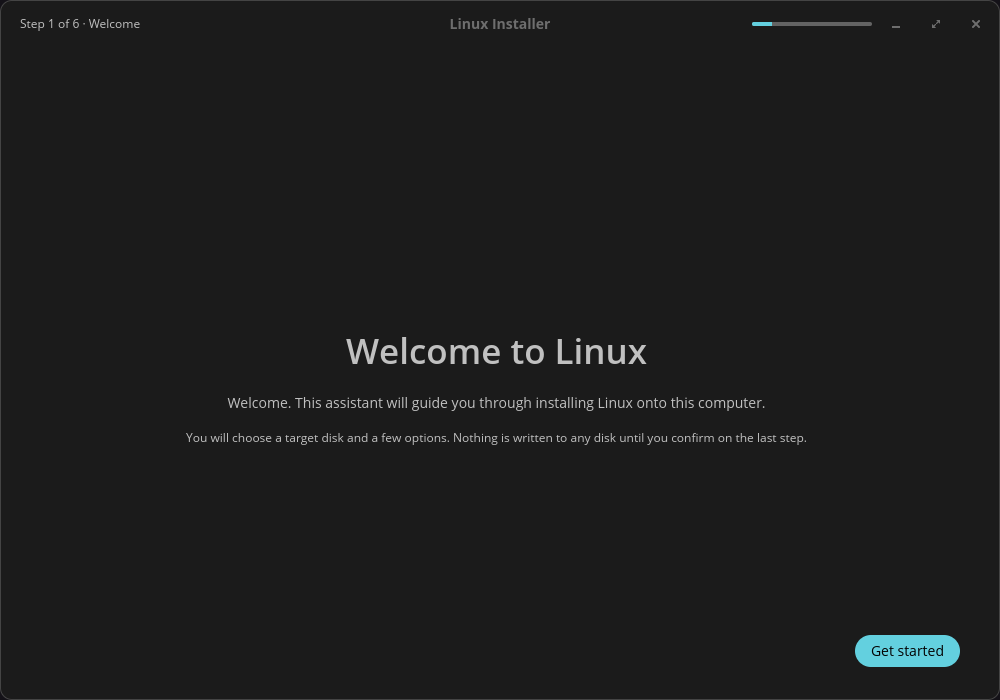
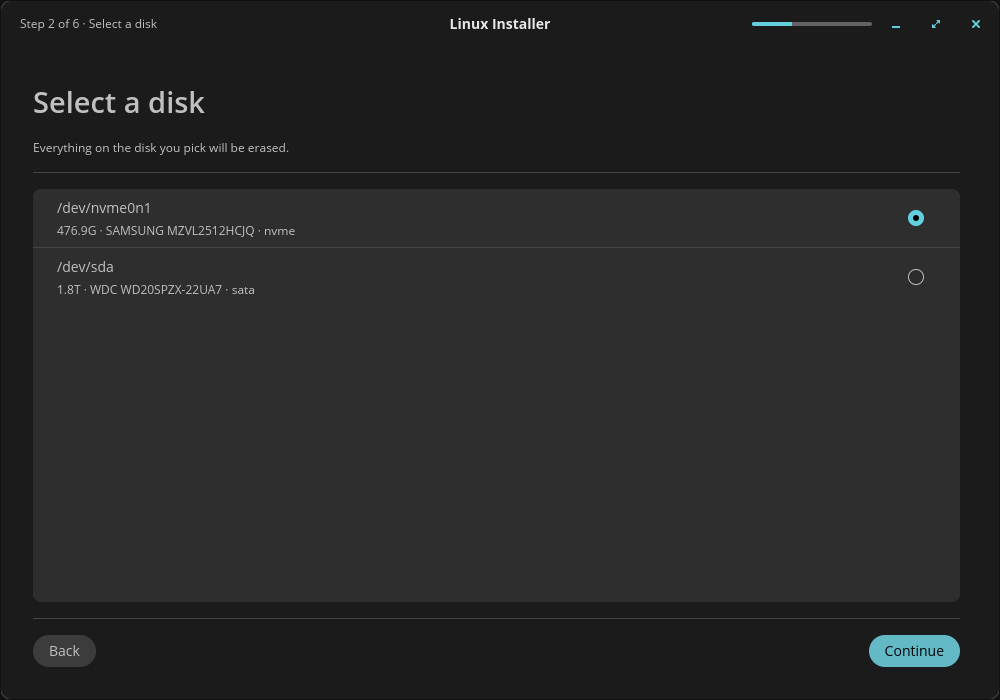

# Getting the COSMIC frontend to build for wasm32

These five patches take `frontends/cosmic` from "48 errors in mio, nowhere
near a browser" to a clean `cargo check --target wasm32-unknown-unknown`.
They are a record of an experiment, not something the build applies: four of
the five belong upstream, and the point of keeping them here is that the
upstream asks are now specific enough to make.

Tracked in #105.

## Result

**It renders, and Playwright can drive it.**

| | |
|---|---|
|  |  |

Real libcosmic: the COSMIC header bar with its window controls, the
`cosmic-theme` dark palette, the step indicator, the accent-coloured pill
button. Drawn by wgpu on WebGL in headless Chromium. One Playwright click at
the "Get started" coordinates advanced it to step 2, which lists the capture
fixtures' disks — so input reaches the widgets, not just the canvas.

"Welcome to Linux" rather than a product name is the branding resolver
behaving correctly: there is no `os-release` in a browser, so it falls
through to the neutral copy, exactly as `shared/branding/README.md`
specifies.

The run is clean — no panics, no unhandled rejections, and the console
carries only WebGPU-unavailable notices (expected; the build asks for
WebGL) and WebGL performance warnings.

## The patches

Eight patches, 278 diff lines. Five belong upstream, three are ours.

| | What | Where it belongs |
|---|---|---|
| `01` | `atomicwrites` has `mod imp` for unix, redox and windows, and no wasm arm, so `imp` does not resolve. Adds one using `std::fs::rename`. | upstream, [jackpot51/rust-atomicwrites](https://github.com/jackpot51/rust-atomicwrites) |
| `02` | `cosmic-config` binds `system_path` under `cfg(unix)` and `cfg(windows)`, then uses it unconditionally. wasm is neither, so it is used but never defined. Adds a `not(any(unix, windows))` arm returning `None`. | upstream, pop-os/libcosmic |
| `03` | libcosmic's vendored `iced_winit` has a **real web path that has bit-rotted** against the winit it pins. Four renamed APIs, one struct field the wasm arm never learned about, one lifetime bound. | upstream, pop-os/libcosmic |
| `06` | `iced_wgpu` sets `VK_LOADER_DRIVERS_DISABLE` under `cfg(wayland_platform)` but **unsets it ungated**. wasm cannot unset an environment variable — std panics rather than failing softly — so every browser build dies there. | upstream, pop-os/libcosmic |
| `07` | libcosmic exposes no way to reach iced's `webgl` feature. Adds a passthrough, off by default. | upstream, pop-os/libcosmic |
| `04` | Our own `offline.rs` imports `std::os::unix` and calls `OpenOptions::mode` unconditionally. Gates both on `cfg(unix)`. | this repo |
| `05` | `tokio` trimmed to the four features this crate uses, libcosmic's `desktop` and `tokio` features dropped, `webgl` enabled, a `cdylib` lib target added. | this repo |
| `08` | A `wasm_bindgen(start)` entry beside `main`, and the two host-dependent calls gated: the `live_iso_image` probe (no host to shell out to) and `scan_disks` (no lsblk, no tokio reactor — it returns the capture fixtures instead). | this repo |

## The interesting one

`03` is the finding worth carrying forward. The assumption was that
libcosmic never intended to run on the web. That is not what the code says:
`iced/winit/src/lib.rs` has `#[cfg(target_arch = "wasm32")]` blocks that
attach a canvas, spawn the event loop through
`wasm_bindgen_futures::spawn_local` and pull the canvas back out of the
window. The web support is **there**, inherited from upstream iced. It has
simply never been compiled, so it drifted:

- winit 0.31 renamed the web extension traits — `WindowAttributesExtWebSys`
  → `WindowAttributesWeb` (and it is now a platform-attributes struct passed
  to `with_platform_attributes`, not an extension trait), `WindowExtWebSys`
  → `WindowExtWeb`, `EventLoopExtWebSys` → `EventLoopExtWeb`.
- `EventLoopExtWeb` no longer has `spawn_app`; `run_app` is the entry point,
  and on web it does not return.
- `Window::canvas()` hands back a `Ref<HtmlCanvasElement>` rather than the
  element.
- Their own `Runner` grew an `is_booted` field that only the non-wasm
  initializer was updated for.
- `spawn_local` needs a `'static` future, so the compositor associated type
  needs a `'static` bound that the non-wasm path never required.

Every one of these is what you would expect from code nobody builds. None of
them is a design problem. A CI job that only ran `cargo check --target
wasm32-unknown-unknown` on libcosmic would have caught all six, and `06`
besides.

`06` is the one worth singling out, because it is a one-line asymmetry with
a total effect: the `set_var` carries `#[cfg(wayland_platform)]` and the
matching `remove_var` carries nothing. On a desktop that is harmless — it
clears a variable that was never set. On wasm `std::env::remove_var` panics
outright, so the compositor never finishes starting and no browser build of
any libcosmic app can draw a frame.

## Running it yourself

`index.html`, `render.mjs` and `drive.mjs` here are the shell and the two
Playwright drivers used for the screenshots above.

```bash
cargo build --target wasm32-unknown-unknown --lib
wasm-bindgen --target web --out-dir web --no-typescript \
    target/wasm32-unknown-unknown/debug/tuna_installer_cosmic.wasm
cd web && npx http-server -p 8099 -s &
node render.mjs 45000     # load, report status and console, screenshot
node drive.mjs            # click through to step 2
```

The debug artefact is 396 MB before `wasm-bindgen` and 46 MB after, which
loads in about 40 seconds. A release build would be far smaller and is what
any real harness should use. Chromium needs `--use-gl=swiftshader
--enable-unsafe-swiftshader` on a runner with no GPU; WebGPU is not
available there, which is why `07` exists.

## Reproducing the build

```bash
cp -r frontends/cosmic /tmp/cosmic-wasm
cp -r <cargo checkout of libcosmic>   /tmp/libcosmic
cp -r <cargo checkout of atomicwrites> /tmp/atomicwrites
# apply 01 and 02 and 03 to the copies, 04 and 05 to /tmp/cosmic-wasm,
# then point Cargo at them:
#   [patch."https://github.com/pop-os/libcosmic"]
#   libcosmic = { path = "/tmp/libcosmic" }
#   cosmic-config = { path = "/tmp/libcosmic/cosmic-config" }
#   cosmic-theme = { path = "/tmp/libcosmic/cosmic-theme" }
#   [patch."https://github.com/jackpot51/rust-atomicwrites"]
#   atomicwrites = { path = "/tmp/atomicwrites" }
cd /tmp/cosmic-wasm && rustup target add wasm32-unknown-unknown
cargo check --target wasm32-unknown-unknown
```

Pinned at libcosmic `43a50cb`, winit `0.31.0-beta.2`
(`pop-os/winit`, tag `cosmic-0.14`), wgpu 28, iced 0.14. The winit API
details above are specific to that pin.
